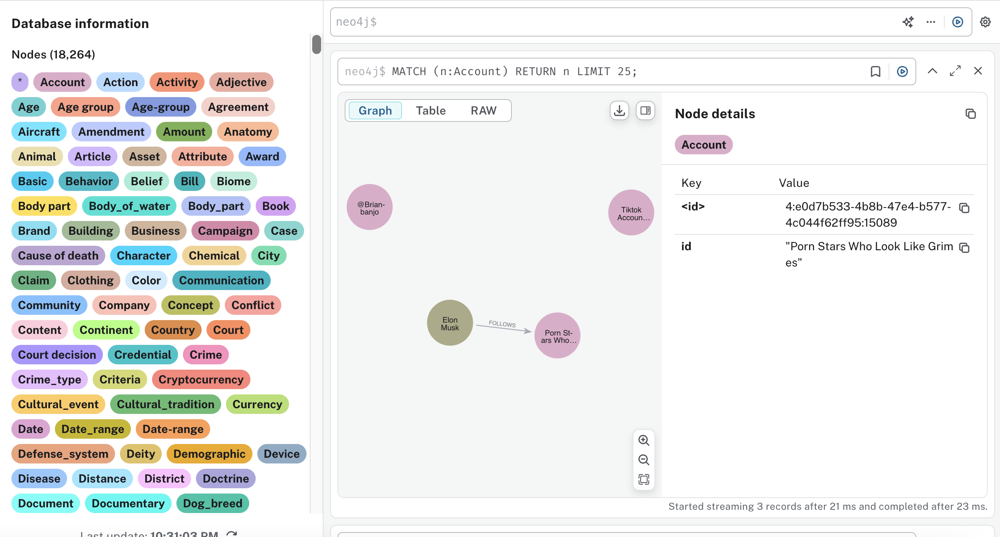

# fact-lens-api
This is the backend API for Fact Lens, a knowledge graph application. It is built using FastAPI and Neo4j. This is the part of INFO 290 Project at UC Berkeley. 

## Prerequisites
- Python 3.8+
- Neo4j 5.26.0+
- Neo4j APOC plugin
- Neo4j Neosemantics (n10s) plugin
- OPENAI API Key
- Twitter API Key
- Firecrawl API Key (optional, for web crawling)

## Published Knowledge Graph from X's Community Notes
Please provide us with your email address of Neo4j Aura if you want to access the knowledge graph. We will send you the invitation link to access the knowledge graph.




## How to setup in your local environment
1. Download Neo4j Desktop
2. Install APOC plugin and follow their instruction
https://neo4j.com/docs/apoc/5/installation/?_gl=1*1gdaha5*_ga*MTk0MDk5NjkzNy4xNzQxNjUyMjM2*_ga_DZP8Z65KK4*MTc0MTY1MjIzNC4xLjEuMTc0MTY1NTIyNi4wLjAuMA..
3. create database
```
- community
```

(optional) if there is problem with APOC or n10s, you can add the following lines to your `neo4j.conf` file:

```
dbms.security.procedures.unrestricted=apoc.*,n10s.*
dbms.security.procedures.allowlist=apoc.*,n10s.*
```
4. Clone this repository:
5. Create and activate a virtual environment:
6. Install the required dependencies:

```
pip install -r requirements.txt
```

4. Create a `.env` file in the project root with:

```
OPENAI_API_KEY=your-openai-api-key
NEO4J_URI=neo4j_uri ex : bolt://localhost:7687
NEO4J_USERNAME=your-neo4j-username
NEO4J_PASSWORD=NEO4J_USERNAME=your-neo4j-password
TWITTER_API_KEY=
TWITTER_API_SECRET_KEY=
TWITTER_ACCESS_BEARER_TOKEN=
TWITTER_ACCESS_TOKEN=
TWITTER_ACCESS_TOKEN_SECRET=
FIRECRAWL_API_KEY=
```

5. To build the knowledge graph using .dump file in the `data` folder using neo4j Desktop according to [this instruction](https://neo4j.com/docs/desktop-manual/current/operations/create-from-dump/#:~:text=Once%20you%20have%20a%20dump,when%20creating%20a%20new%20DBMS.)
```
- community.dump: the dump file for the community database (process all community notes)
```
6. Start the Neo4j server and ensure it is running.
7. Run the FastAPI server:
```
uvicorn main:app --reload
```

8. Access the API documentation at `http://localhost:8000/docs`.

## How the system works

The system uses a combination of a knowledge graph stored in Neo4j and a fact-checking agent powered by OpenAI's GPT-4 model. The fact-checking agent retrieves relevant information from the knowledge graph to assess the veracity of claims made in tweets.


## API Endpoints
- `GET /facts/{twitter_id}`: Retrieve a fact by  ID. 

* Tweet_id is the id of a tweet, for example if the url is https://x.com/antonyjackson33/status/1768162650523930921
Tweet_id is 1768162650523930921


Example response
```
{
  "confidenceScores": 82,
  "reasoning": "Most available evidence leans toward the claim being accurate, though some contextual nuances remain unclear.",
  "sources": [
    {
      "title": "Community Note #1421",
      "ratingStance": "Mostly Support",
      "snippet": "Multiple users referenced historical data showing the event occurred as described."
    },
    {
      "title": "Community Note #889",
      "ratingStance": "Partially Support",
      "snippet": "Provides supporting details but also indicates missing supporting citations."
    }
  ]
}
```

## Files & Directories
```
fact-lens-api/
├── data/
│   ├──community.dump               # Dump file for the community database (process all community notes)  
├── KnowledgeGraphService.py  # Python class to connect to the Neo4j database
├── FactCheckAgent.py          # Python script to create a fact-checking agent
├── main.py                     # Python script to create a REST API for the fact-checking agent and extension
├── TwitterXAPIService.py       # Python class to connect to Twitter X API
├── ValidateKnowledgeGraph.py       # Python script to validate the knowledge graph using SHACL
├── data.ttl                     # Shacl file for data validation
├── shapes.ttl                    # Shacl file for shapes validation
├── requirements.txt              # Python dependencies
├── settings.py                    #  Configuration settings class for the project
├── README.md                    # Project documentation
```
